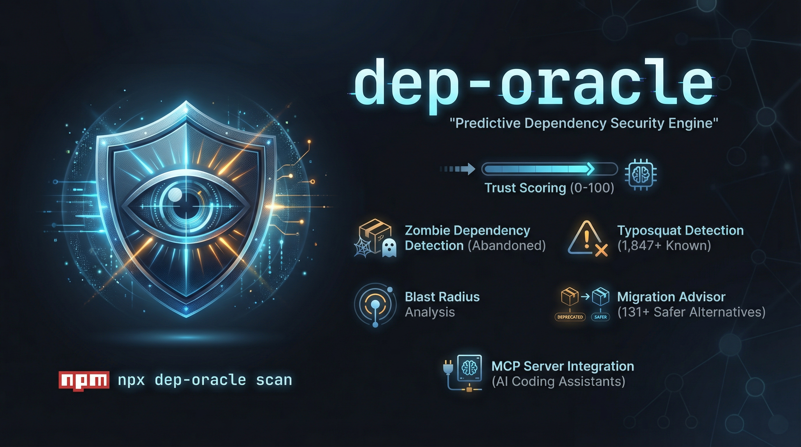

<p align="center">
  
</p>

<p align="center">
  <h1 align="center">dep-oracle</h1>
  <p align="center"><strong>Predictive Dependency Security Engine</strong></p>
  <p align="center">
    <a href="https://www.npmjs.com/package/dep-oracle"></a>
    <a href="https://opensource.org/licenses/MIT"></a>
    <a href="https://www.npmjs.com/package/dep-oracle"></a>
    <a href="https://github.com/ertugrulakben/dep-oracle"></a>
    <a href="https://registry.modelcontextprotocol.io/servers/io.github.ertugrulakben%2Fdep-oracle"></a>
  </p>
  <p align="center">
    <a href="#quick-start">Quick Start</a> &middot;
    <a href="#features">Features</a> &middot;
    <a href="#trust-score-algorithm">Algorithm</a> &middot;
    <a href="#claude-code-integration-mcp">MCP</a> &middot;
    <a href="#comparison">Comparison</a>
  </p>
  <p align="center">
    <strong>English</strong> | <a href="README.tr.md">Turkce</a>
  </p>
</p>

---

> **Your dependencies have dependencies. Who's watching them?**

**dep-oracle** is a predictive dependency security engine that calculates **Trust Scores** (0-100) for every package in your dependency tree. It detects zombie dependencies, measures blast radius, catches typosquatting attempts, and predicts future risks — before they become vulnerabilities.

**Claude Code Security** scans YOUR code. **dep-oracle** scans everything your code **depends on**.

## Why?

- **62% of breaches** in 2025 came from supply chain attacks
- The average project has **683 transitive dependencies**
- `npm audit` only catches **known** CVEs — dep-oracle **predicts** future risks
- You audit your code. But do you audit your **trust**?

## Quick Start

```bash
# Zero install — just run it
npx dep-oracle

# Or install globally
npm install -g dep-oracle
dep-oracle scan

# Check a single package
dep-oracle check express
```

## Features

| Feature | Description |
|---------|-------------|
| **Trust Score** | 0-100 weighted score per package (security, maintainer health, activity, popularity, funding, license) |
| **Zombie Detection** | Finds unmaintained but critical packages (no commits in 12+ months) |
| **Blast Radius** | Shows how many files are affected if a dependency is compromised |
| **Typosquat Detection** | 1,847+ known packages + live npm registry lookup to catch suspicious names |
| **Trend Prediction** | 3-month risk projection based on download/commit/release trends |
| **Migration Advisor** | 131 package mappings with 192 safer alternatives for risky dependencies |
| **Offline Mode** | Works from cache without internet (`--offline`) |
| **MCP Server** | Native Claude Code integration — ask about your dependencies in natural language |
| **Multi-Format Output** | Terminal (colored tree), HTML, JSON, and SARIF |
| **GitHub Action** | Automate trust checks in your CI/CD pipeline |

## Usage

```bash
# Scan current project
dep-oracle scan

# Scan with specific output format
dep-oracle scan --format json
dep-oracle scan --format html
dep-oracle scan --format sarif

# Check a single package
dep-oracle check lodash
dep-oracle check express@4.18.2

# Offline mode (uses cached data only)
dep-oracle scan --offline

# Set minimum score threshold (exit code 1 if below)
dep-oracle scan --threshold 60

# Ignore specific packages
dep-oracle scan --ignore deprecated-but-needed,legacy-pkg

# Verbose logging
dep-oracle scan --verbose
```

## Output Example

```
dep-oracle v1.1.1
Scanning package.json...
Found 47 direct dependencies, 683 transitive
Collecting data... [=============================] 100% (2.3s)

DEPENDENCY TRUST REPORT
━━━━━━━━━━━━━━━━━━━━━━━━━━━━━━━━━━━━━━━━━━━━━━━

  CRITICAL (score < 50)

  ■ event-stream@3.3.6         Score: 12  ZOMBIE
    Last commit: 2018 | 0 maintainers active
    Blast radius: 14 files | Alternative: highland

  WARNING (score 50-79)

  ■ moment@2.29.4              Score: 58  ZOMBIE
    Maintenance mode | No new features
    Blast radius: 23 files | Alternative: dayjs, date-fns, luxon

  SAFE (score 80+): 679 packages

━━━━━━━━━━━━━━━━━━━━━━━━━━━━━━━━━━━━━━━━━━━━━━━
SUMMARY
  Overall Trust Score: 74/100
  Critical: 2 | Warning: 3 | Safe: 679
  Zombies: 2 | Deprecated: 1
```

## Trust Score Algorithm

Each package is scored 0-100 based on six weighted metrics:

| Metric | Weight | What It Measures |
|--------|--------|------------------|
| Security History | 25% | CVE count with diminishing penalty, average patch time, fast-patch bonus |
| Maintainer Health | 25% | Active maintainers (bus factor), issue response time, PR merge speed |
| Activity | 20% | Commit frequency trend, release cadence, last publish recency |
| Popularity | 15% | Weekly downloads, dependent count, GitHub stars |
| Funding | 10% | GitHub Sponsors, OpenCollective, corporate backing |
| License | 5% | MIT/Apache = safe, GPL = risk, Unknown = red flag |

**Score Ranges:** 80-100 Safe | 50-79 Warning | 0-49 Critical

### Security Scoring

The security metric uses a **diminishing penalty** model — the first vulnerability has the highest impact, and each additional one has progressively less effect:

| Vulnerabilities | Security Score |
|-----------------|---------------|
| 0 | 100 |
| 1 | 85 |
| 2 | 72 |
| 3 | 60 |
| 4 | 50 |
| 5+ | max(20, 100 - n*12) |

Packages that patch vulnerabilities quickly (within 7 days) receive a **+10 bonus**. Slower patches (within 30 days) receive **+5**.

### Graceful Degradation

If an API is unreachable (GitHub down, no internet, rate limited), dep-oracle doesn't crash. The missing metric weight is redistributed across available metrics. If 3+ metrics are unavailable, a reliability warning is shown.

## Typosquat Detection

dep-oracle uses a multi-layer approach to catch typosquatting:

1. **Static registry** — 1,847+ known popular package names across 40+ categories (React, Vue, Angular, Express, testing, CLI tools, etc.)
2. **Dynamic npm lookup** — Fetches the top 5,000 most-downloaded packages from npm and caches them for 7 days
3. **Pattern matching** — Levenshtein distance, prefix/suffix manipulation, character swap, missing/extra letter detection

```bash
dep-oracle check expresss    # Catches: similar to "express" (distance: 1)
dep-oracle check lodashe     # Catches: similar to "lodash" (distance: 1)
dep-oracle check react-js    # Catches: suffix pattern of "react"
```

## Migration Advisor

When a package scores low or is flagged as a zombie, dep-oracle suggests safer alternatives from a curated database of **131 package mappings** with **192 alternatives**:

```
moment     → dayjs, date-fns, luxon
request    → axios, got, node-fetch, undici
lodash     → lodash-es, radash, just (native alternatives)
express    → fastify, koa, hono
gulp       → esbuild, tsup, vite
mocha      → vitest, jest, node:test
...and 125 more
```

Each suggestion includes difficulty rating (easy/moderate/hard) and migration context.

## Claude Code Integration (MCP)

dep-oracle is listed on the official **[MCP Registry](https://registry.modelcontextprotocol.io/servers/io.github.ertugrulakben%2Fdep-oracle)** and works as an MCP server for Claude Code:

```json
// .claude/settings.json
{
  "mcpServers": {
    "dep-oracle": {
      "command": "npx",
      "args": ["dep-oracle", "mcp"]
    }
  }
}
```

Then in Claude Code, just ask:
- *"What's the riskiest dependency in this project?"*
- *"Is lodash safe to use?"*
- *"Show me zombie dependencies"*
- *"Suggest alternatives for moment.js"*

**Available MCP Tools:**

| Tool | Description |
|------|-------------|
| `dep_oracle_scan` | Full project dependency scan |
| `dep_oracle_trust_score` | Trust score for a single package |
| `dep_oracle_blast_radius` | Impact analysis for a package |
| `dep_oracle_zombies` | List all zombie dependencies |
| `dep_oracle_suggest_migration` | Get alternative package suggestions |

## GitHub Action

```yaml
name: Dependency Trust Check
on: [pull_request]

jobs:
  dep-oracle:
    runs-on: ubuntu-latest
    steps:
      - uses: actions/checkout@v4
      - uses: ertugrulakben/dep-oracle-action@v1
        with:
          threshold: 60
          format: sarif
```

## Configuration

Create `.dep-oraclerc.json` in your project root:

```json
{
  "threshold": 60,
  "ignore": ["known-risky-but-needed"],
  "format": "terminal",
  "offline": false,
  "githubToken": "$GITHUB_TOKEN",
  "cacheTtl": 86400
}
```

Or add to `package.json`:

```json
{
  "dep-oracle": {
    "threshold": 60,
    "ignore": []
  }
}
```

### Configuration Options

| Option | Default | Description |
|--------|---------|-------------|
| `threshold` | `60` | Minimum trust score. Packages below trigger warnings and non-zero exit |
| `ignore` | `[]` | Packages to skip during scanning |
| `format` | `"terminal"` | Output format: `terminal`, `json`, `html`, `sarif` |
| `offline` | `false` | Use only cached data, skip all API calls |
| `githubToken` | `null` | GitHub token for higher API rate limits (5000/hr vs 60/hr) |
| `cacheTtl` | `86400` | Cache TTL in seconds (default: 24 hours) |

## Supported Package Managers

| Manager | Manifest | Lock File | Status |
|---------|----------|-----------|--------|
| npm | `package.json` | `package-lock.json` | Supported |
| yarn | `package.json` | `yarn.lock` | Supported |
| pnpm | `package.json` | `pnpm-lock.yaml` | Supported |
| pip | `requirements.txt` | `Pipfile.lock` | Supported |
| poetry | `pyproject.toml` | `poetry.lock` | Supported |

## Comparison

| Feature | npm audit | Dependabot | Socket.dev | Snyk | **dep-oracle** |
|---------|-----------|------------|------------|------|----------------|
| Known CVE scan | Yes | Yes | Yes | Yes | **Yes** |
| Predictive risk | No | No | Partial | No | **Yes** |
| Trust Score (0-100) | No | No | No | No | **Yes** |
| Zombie detection | No | No | No | No | **Yes** |
| Blast radius | No | No | No | No | **Yes** |
| Typosquat detection | No | No | Yes | No | **Yes** |
| Trend prediction | No | No | No | No | **Yes** |
| Migration advisor | No | Partial | No | Partial | **Yes (131 pkgs)** |
| MCP integration | No | No | Yes | Yes | **Yes** |
| Zero install (npx) | Yes | No | No | No | **Yes** |
| Free & open source | Yes | Yes | Freemium | Freemium | **Yes** |

## Programmatic API

```typescript
import { scan, checkPackage } from 'dep-oracle';

// Scan a project
const report = await scan({ dir: './my-project', format: 'json' });

// Check a single package
const result = await checkPackage('express');
console.log(result.trustScore); // 74
console.log(result.isZombie);   // false
```

## Test Suite

dep-oracle has comprehensive test coverage:

```
10 test files | 144 tests | 100% passing

  trust-score.test.ts     34 tests   Scoring engine, metrics, edge cases
  zombie-detector.test.ts 10 tests   Zombie detection logic
  typosquat.test.ts       15 tests   Typosquat pattern matching
  migration-advisor.test.ts 12 tests Migration suggestions
  trend-predictor.test.ts 10 tests   Trend prediction engine
  parsers.test.ts         17 tests   npm + Python parsers
  cache.test.ts           15 tests   Cache store operations
  logger.test.ts          17 tests   Logger utility
  rate-limiter.test.ts    6 tests    Rate limiter
  schema.test.ts          8 tests    Zod schema validation
```

```bash
npm test          # Run all tests
npm run lint      # TypeScript type checking
```

## Changelog

### v1.1.1 (2026-02-22)

- **MCP Registry**: Listed on the official [MCP Registry](https://registry.modelcontextprotocol.io/servers/io.github.ertugrulakben%2Fdep-oracle) as `io.github.ertugrulakben/dep-oracle`
- **Dynamic Versioning**: MCP server and SARIF reporter now read version from package.json (no more hardcoded versions)

### v1.1.0 (2026-02-22)

- **Typosquat Detection**: Expanded to 1,847+ known packages across 40+ categories, plus dynamic npm registry fetch (top 5,000 packages, 7-day cache)
- **Migration Advisor**: Expanded to 131 package mappings with 192 safer alternatives
- **Trust Score Calibration**: Diminishing vulnerability penalty (first CVE has highest impact), fast-patch bonus (+10 for <=7 days)
- **Poetry.lock Support**: Full poetry.lock parsing for Python projects
- **Comprehensive Test Suite**: 10 test files, 144 tests covering all analyzers, parsers, cache, and utilities
- **Turkish README**: Full Turkish documentation (README.tr.md)
- **Dynamic CLI Version**: Version automatically synced from package.json

### v1.0.0 (2026-02-22)

- Initial release
- Trust Score engine with 6 weighted metrics
- npm + Python (pip, poetry, pyproject.toml) parsers
- Zombie detection, blast radius analysis
- Typosquat detection with Levenshtein distance
- Trend prediction (3-month risk projection)
- Migration advisor with curated alternatives
- Terminal, HTML, JSON, SARIF output formats
- MCP server for Claude Code integration
- GitHub Action support
- Offline mode with SQLite-compatible cache
- Badge generator (SVG)

## Contributing

See [CONTRIBUTING.md](CONTRIBUTING.md) for development setup, coding standards, and how to add new collectors, parsers, or analyzers.

## License

[MIT](LICENSE) — [Ertugrul Akben](https://ertugrulakben.com)
